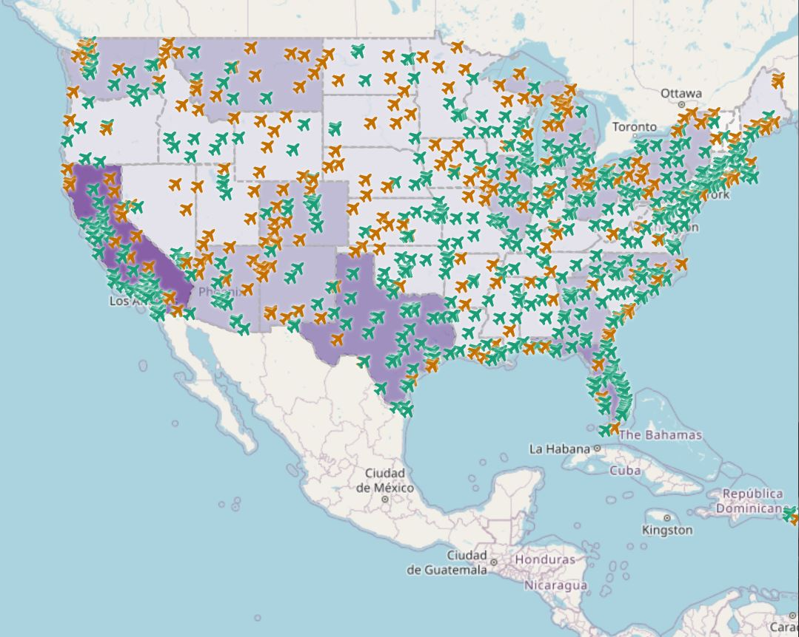

# alexz1Lab3.github.io
<!DOCTYPE html>
<html>
  <head>
  </head>
  <body>

<a href ="">Here is my interative project link</a>

<h6> The project that I did in this lab was to create a map of airports in the United States. As the darker the shade of purple is, the more airports each states has. While the two different airplane icons represents airports with and without air traffic control towers. </h6>

<h5> Libraries </h5> 
 Libraries are extremly useful because you can load libraries in the code such as what I did with the Legend to create the so called lobster font. If someone does not have the font, it will change the font into something default so visitors can see. While anyone can use these libraries to include in the code (which is a link) to link to the styles, it is very useful and makes finding fonts less tedious.

<h5> Data Sources </h5> 

This is important as everyone should know who created the map. This prevents copyrights and also can track who created it so if adjustments are needed legality, questions, purpose & credibility it is all here written in the code. A data source that I used on this map was a base map that I used from Leaflet.

<h5> Other Primary functions </h5> 

There are many primary functions that I used in this lab such as using CSS to change the colors of the fonts, Adding "Font Awesome" to the CSS class, using Chroma.js to minipulate html elements, adding geoJson layers that were shapefiles and many more. 

<h5> Credit Acknowledgment </h5> 

The map was created by Alex Zhen (author) for Geography 458 class. Other sources of data used was my basemap from Leaf-let. The projection of the map is int he coordinate system of WGS 1984. 

  </body>
</html>
